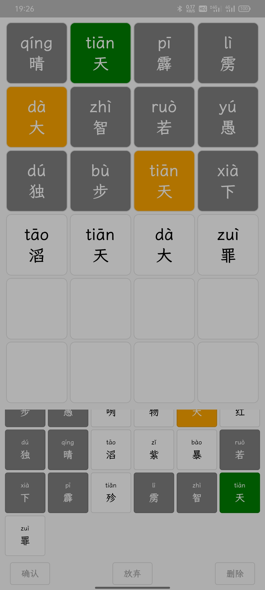

# Wordle

一个针对中文成语和诗词的 Wordle

## 特点:

* 同时支持成语和诗词的 Wordle

* 全离线使用, 不用担心任何记录信息

* 做不出来轻松 hack, 点放弃也能继续做

* 代码真的写的很辣鸡

## 截图:

## TODO:

* 个人本地统计数据支持

* 分享题目 ID 后自动唤醒并跳转

* 丰富词库/诗词集, 补全诗词集缺失内容

* 重构代码

## 备注:

* 数据来源自
  * [中华新华字典数据库和 API](https://github.com/pwxcoo/chinese-xinhua)
  * [THUOCL：清华大学开放中文词库](http://thuocl.thunlp.org/)

