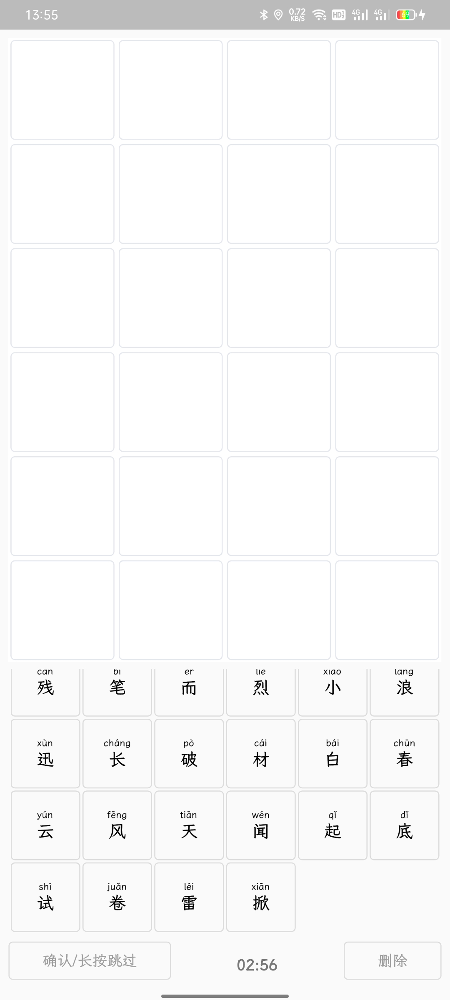
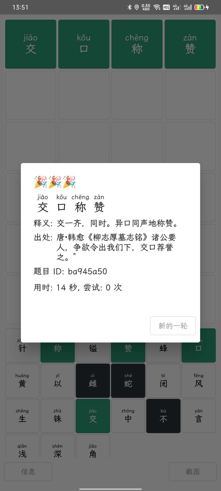
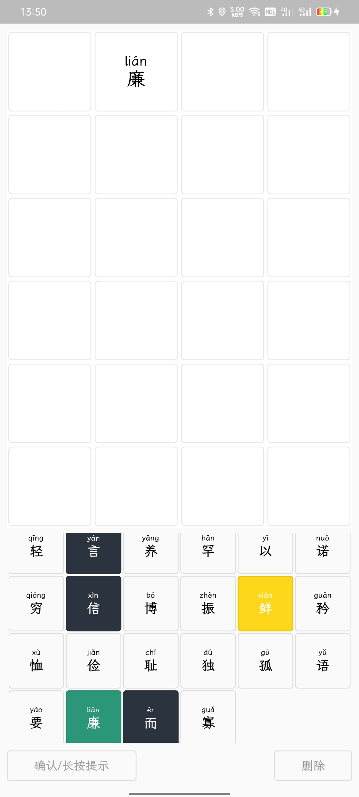
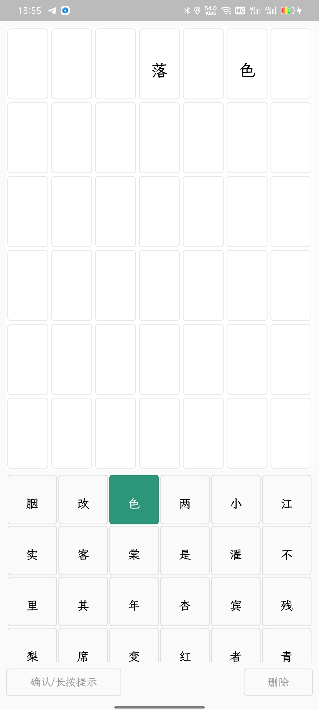

# Wordle

一个针对中文成语和诗词的 Wordle

## 特点:

* 同时支持成语和诗词的 Wordle

* 全离线使用, 不用担心任何记录信息

* 做不出来也有提示, 要么直接推出重进也能行

* 代码真的写的很**辣鸡**

## 截图:

## 更新日志:

### 2.0.1

* 重建了题目的数据库, 调整了组题逻辑, 并将困难模式正式加入支持
* 现在普通模式也支持放弃了 (*^_^*)
* 现在APK有了一个土里土气的图标了

### 2.0.0
 * 完全重构代码, 改为 Provider 管理状态
 * 优化动画效果, 提升动画流畅度
 * 增加竞速模式, 每15s生成提示, 可以跳过
 * 增加诗词模式, 初始化提示 25% 的单字
 * 增加提示功能
 * 支持截图分享 Wordle 图片
 * 优化组题逻辑, 区分题目难易度

### 1.0.3
 * 修复了上个版本题目 ID 无法正常工作的问题
 * 修复了上个版本完成游戏后, 仍然可以重复点击确认和删除的问题
 * 优化了界面底部的按钮, 将其略微抬高
 * 优化组题逻辑, 提高复杂度
 * 支持完成题目总数, 总尝试次数的基本统计信息, 但目前仍然不支持排除已完成题目, 该功能将在选单实现后完成
 * 添加文件访问权限, 实现统计信息功能, 若不给予权限, 将不保存用户统计信息
 * 代码变得**更辣鸡了**

### 1.0.2
 * ~~被吃掉了~~

### 1.0.1
  * 修复切换题目时, 由于未更新动画控制器导致数组越界的BUG
  * 将随机题目拆分为 "随机成语" 和 "随机诗词" 两个按钮

## TODO:

* 个人本地统计数据支持

* 分享题目 ID 后自动唤醒并跳转

* 丰富词库/诗词集, 补全诗词集缺失内容

## 备注:

* 字体来源
  * [LXGW WenKai / 霞鹜文楷](https://github.com/lxgw/LxgwWenKai)

* 数据来源自
  * [中华新华字典数据库和 API](https://github.com/pwxcoo/chinese-xinhua)
  * [THUOCL：清华大学开放中文词库](http://thuocl.thunlp.org/)

